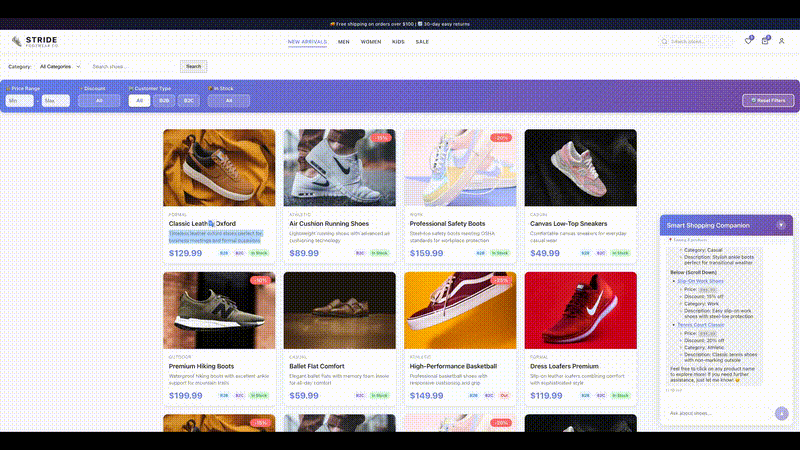

# Browsing Companion - DOM Snapshot Injection Demo

A context-aware **browsing companion** demo for e-commerce that "sees" what the user is viewing through DOM snapshot injection. Built with React, Node.js, Python, and Microsoft Foundry.

[](https://www.linkedin.com/in/dvanderuit/)

> 📦 **Open Source**: This repository (Method 1) is freely available. [Other methods](docs/CONTEXT_AWARE_METHODS.md) describe more advanced implementations — if your organization is interested in reviewing or implementing those approaches, feel free to [reach out via LinkedIn](https://www.linkedin.com/in/dvanderuit/).

### Why "Browsing Companion" and not "Chatbot"?

A traditional chatbot responds to user questions based on static knowledge or predefined scripts. A **browsing companion** goes further:

| Chatbot | Browsing Companion |
|---------|--------------------|
| Responds to what you *ask* | Responds to what you *see* |
| Static knowledge base | Real-time viewport awareness |
| Text-only interaction | Visual context + conversation |
| You describe what you're looking at | It already knows what you're looking at |
| Generic responses | Personalized to your current view |

The browsing companion acts as a **copilot** that shares your screen context, understands your scroll position, and can guide you through the page, not just answer questions about it.

> ⚠️ **Note**: This is a demo/proof-of-concept project. There may be bugs, issues, or areas for improvement. **Feedback, pull requests, and contributions of any kind are highly appreciated!** Feel free to open issues or submit PRs.
>
> 📊 **Production Readiness**: For production implementations, review [this report](docs/ENTERPRISE_GRADE_SCORE.md) to understand the security, testing, and observability improvements needed to take this from demo to production-ready.

## 📑 Table of Contents

- [🎯 Overview](#-overview)
- [🏗️ Architecture](#️-architecture)
- [📋 Prerequisites](#-prerequisites)
- [🚀 Quick Start](#-quick-start)
- [🎮 Using the Demo](#-using-the-demo)
- [✨ Key Features](#-key-features)
- [🏛️ Implementation Approach](#️-implementation-approach)
- [📁 Project Structure](#-project-structure)
- [🔧 Configuration](#-configuration)
- [🧪 Development](#-development)
- [📚 Learn More](#-learn-more)
- [💼 About This Repository](#-about-this-repository)
- [📄 License](#-license)
- [🤝 Contributing](#-contributing)

## 🎯 Overview

This project demonstrates a shoe e-commerce website where an AI browsing companion can:
- See which products are currently visible on the user's screen
- **Track products in three visibility zones**: visible, above the fold (scrolled past), and below the fold (not yet visible)
- Guide users to scroll up or down when matching products are outside the visible area
- Provide personalized recommendations based on user preferences (B2B/B2C, category filters)
- Answer questions about visible products using context from DOM snapshots



*Live demo showing the AI browsing companion in action — filtering products, answering questions about visible items, and providing context-aware responses in real-time.*

## 🏗️ Architecture

```
┌─────────────┐     ┌──────────────┐     ┌─────────────┐     ┌──────────────────┐
│   React     │────▶│   Node.js    │────▶│   Python    │────▶│ Microsoft Foundry│
│   Frontend  │     │   Gateway    │     │  AI Service │     │  (GPT-4o-mini)   │
│  (Port 3000)│     │  (Port 3001) │     │ (Port 8000) │     │   + AI Agent     │
└─────────────┘     └──────────────┘     └─────────────┘     └──────────────────┘
       │                    │                     │
       │                    │                     ├──────▶ Cosmos DB (user data)
       │                    │                     └──────▶ Blob Storage (snapshots)
       │                    │                     |
       └────── DOM Snapshot Capture ──────────────┘
```

**Tech Stack**: React 18 + TypeScript + Vite | Node.js + Express | Python + FastAPI + Microsoft Agent Framework | Microsoft Foundry (AI Services) + Cosmos DB + Blob Storage | Azure Bicep IaC

## 📋 Prerequisites

- **Azure CLI** installed and logged in ([Installation Guide](https://docs.microsoft.com/en-us/cli/azure/install-azure-cli))
- **Azure Subscription** with permissions to create resources
- **Node.js** v18+ ([Download](https://nodejs.org/))
- **Python** 3.11+ ([Download](https://www.python.org/))

**⏱️ Total setup time**: ~20-25 minutes from clone to running application

## 🚀 Quick Start

### 1. Clone and Deploy Azure Infrastructure

```bash
git clone https://github.com/doruit/Browsing-Companion-DOM-snapshot-injection.git
cd Browsing-Companion-DOM-snapshot-injection

# Login to Azure
az login --use-device-code

# Deploy Azure resources (~10-15 min)
./scripts/deploy.sh

# Configure local environment files
./scripts/setup-env.sh
```

**💰 Estimated Cost**: Cosmos DB free tier + Microsoft Foundry AI Services pay-as-you-go (~\$0.01-0.03/chat) + minimal storage

### 2. Install Dependencies

```bash
# Python AI Service
cd services/ai-service
python -m venv venv
source venv/bin/activate  # Windows: venv\Scripts\activate
pip install -r requirements.txt
cd ../..

# Node.js API Gateway
cd services/api-gateway && npm install && cd ../..

# React Frontend
cd frontend && npm install && cd ..
```

### 3. Start Services

```bash
# Start all services (runs in background, logs to logs/ directory)
./scripts/start-all-services.sh

# To stop all services
./scripts/stop-all-services.sh
```

### 4. Open http://localhost:3000

**Demo Credentials**: \`user1@example.com\` / \`password\` (B2C) or \`user2@example.com\` / \`password\` (B2B)

> 🔧 **Having issues?** See the [Troubleshooting Guide](docs/TROUBLESHOOTING.md)

## 🎮 Using the Demo

1. **Login** with demo credentials
2. **Browse products** - scroll through the shoe catalog
3. **Chat with the companion** - Click the chat widget and ask:
   - "What products can you see on my screen?"
   - "Which shoes have discounts right now?"
   - "Filter on shoes between 50 and 120 dollars"

The AI can see which products are currently visible in your viewport!


## ✨ Key Features

| Feature | Description |
|---------|-------------|
| 🤖 **Context-Aware AI** | Detects visible products using Intersection Observer, tracks above/visible/below fold zones |
| 🎯 **Natural Language Filters** | "Show discounted shoes" or "Shoes \$50-\$120" automatically updates UI filters |
| ✨ **Rich Markdown Responses** | Formatted with headers, emojis, bullet points |
| ⚙️ **Dual Control** | Manual filter bar + chat commands stay synchronized |
| 🔗 **Click-to-Scroll** | Click product names in chat to scroll and highlight them |

## 🏛️ Implementation Approach

This repo demonstrates **Method 1: Client-Side DOM Snapshot** — the simplest approach to context-aware browsing companions.

| Method | Time | Cost/User/Mo | Best For |
|--------|------|--------------|----------|
| **1. Client DOM** (This Repo) | 1-2 days | \$0.001 | Demos, MVPs |
| 3. Cosmos DB Sessions | 1-2 weeks | \$0.02 | Production apps |
| 5. Vector Embeddings | 2-3 weeks | \$0.30 | AI recommendations |
| 6. Multi-Modal + Graph | 2-3 months | \$6.00 | Enterprise scale |

**[📚 Full implementation guide for all 6 methods →](docs/CONTEXT_AWARE_METHODS.md)**

## 📁 Project Structure

```
├── frontend/                 # React + TypeScript + Vite
│   └── src/components/ChatWidget/  # Chat UI with DOM capture
├── services/
│   ├── ai-service/           # Python FastAPI + Azure OpenAI
│   └── api-gateway/          # Node.js Express + product data
├── infra/                    # Azure Bicep templates
└── scripts/                  # Deploy and setup scripts
```

## 🔧 Configuration

Environment variables are auto-generated by \`setup-env.sh\` in \`.env.local\` files:

| Service | Key Variables |
|---------|---------------|
| AI Service | `AI_FOUNDRY_PROJECT_ENDPOINT`, `MODEL_DEPLOYMENT_NAME`, `COSMOS_CONNECTION_STRING` |
| API Gateway | `AI_SERVICE_URL`, `JWT_SECRET`, `CORS_ORIGIN` |
| Frontend | `VITE_API_URL` |

## 🧪 Development

- **Add products**: Edit \`services/api-gateway/data/products.json\`
- **Customize chat**: Modify \`frontend/src/components/ChatWidget/\`
- **Extend context**: Add providers in \`services/ai-service/services/context_provider.py\`
- **Cleanup Azure**: \`az group delete --name \$(jq -r '.resourceGroupName.value' deployment-outputs.json) --yes\`

## 📚 Learn More

| Resource | Description |
|----------|-------------|
| [Technical Deep Dive](docs/TECHNICAL_DEEP_DIVE.md) | How DOM capture and viewport awareness works |
| [Context-Aware Methods](docs/CONTEXT_AWARE_METHODS.md) | All 6 implementation approaches compared |
| [Enterprise Grade Score](docs/ENTERPRISE_GRADE_SCORE.md) | Production readiness assessment |
| [Troubleshooting](docs/TROUBLESHOOTING.md) | Common setup issues and solutions |
| [AI Development Notes](docs/AI_DEVELOPMENT_NOTES.md) | How AI coding agents were used |

---

## 💼 About This Repository

This repository is **open source** and demonstrates **Method 1** (Client-Side DOM Snapshot). For production implementations of this, I'm available for commercial engagements.

[](https://www.linkedin.com/in/dvanderuit/)

## 📄 License

MIT License - See LICENSE file for details

## 🤝 Contributing

This is a demo project. Feel free to fork and adapt for your needs!

---

Built with ❤️ using Microsoft Foundry and Azure AI Services
