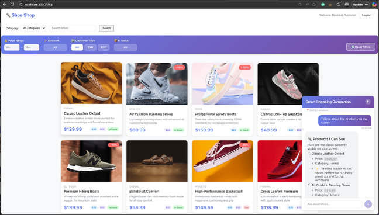

# Browsing Companion - DOM Snapshot Injection Demo

A context-aware **browsing companion** demo for e-commerce that "sees" what the user is viewing through DOM snapshot injection. Built with React, Node.js, Python, and Microsoft Foundry.

### Why "Browsing Companion" and not "Chatbot"?

A traditional chatbot responds to user questions based on static knowledge or predefined scripts. A **browsing companion** goes further:

| Chatbot | Browsing Companion |
|---------|--------------------|
| Responds to what you *ask* | Responds to what you *see* |
| Static knowledge base | Real-time viewport awareness |
| Text-only interaction | Visual context + conversation |
| You describe what you're looking at | It already knows what you're looking at |
| Generic responses | Personalized to your current view |

The browsing companion acts as a **copilot** that shares your screen context, understands your scroll position, and can guide you through the page, not just answer questions about it.

> ⚠️ **Note**: This is a demo/proof-of-concept project. There may be bugs, issues, or areas for improvement. **Feedback, pull requests, and contributions of any kind are highly appreciated!** Feel free to open issues or submit PRs.

## 📑 Table of Contents

- [🎯 Overview](#-overview)
- [🏗️ Architecture](#️-architecture)
- [📋 Prerequisites](#-prerequisites)
- [🚀 Quick Start](#-quick-start)
- [🔧 Troubleshooting Setup Issues](#-troubleshooting-setup-issues)
- [🎮 Using the Demo](#-using-the-demo)
- [✨ Key Features Demonstrated](#-key-features-demonstrated)
- [🏛️ Implementation Approach](#️-implementation-approach)
- [📁 Project Structure](#-project-structure)
- [🔧 Configuration](#-configuration)
- [🧪 Development](#-development)
- [🧹 Cleanup](#-cleanup)
- [🐛 Troubleshooting](#-troubleshooting)
- [📚 Learn More](#-learn-more)
- [🤖 Development Notes](#-development-notes)
- [📄 License](#-license)
- [🤝 Contributing](#-contributing)

## 🎯 Overview

This project demonstrates a shoe e-commerce website where an AI browsing companion can:
- See which products are currently visible on the user's screen
- **Track products in three visibility zones**: visible, above the fold (scrolled past), and below the fold (not yet visible)
- Guide users to scroll up or down when matching products are outside the visible area
- Provide personalized recommendations based on user preferences (B2B/B2C, category filters)
- Answer questions about visible products using context from DOM snapshots
- Maintain conversation history and user preferences



*Live demo showing the AI browsing companion filtering products by price range ($50-$120) using natural language, while displaying context-aware responses about the 8 visible products on screen.*

## 🏗️ Architecture

```
┌─────────────┐     ┌──────────────┐     ┌─────────────┐     ┌──────────────────┐
│   React     │────▶│   Node.js    │────▶│   Python    │────▶│  Azure OpenAI    │
│   Frontend  │     │   Gateway    │     │  AI Service │     │  (GPT-4o-mini)   │
│  (Port 3000)│     │  (Port 3001) │     │ (Port 8000) │     │                  │
└─────────────┘     └──────────────┘     └─────────────┘     └──────────────────┘
       │                    │                     │
       │                    │                     ├──────▶ Cosmos DB (user data)
       │                    │                     └──────▶ Blob Storage (snapshots)
       │                    │                     |
       └────── DOM Snapshot Capture ──────────────┘
```

### Tech Stack
- **Frontend**: React 18 + TypeScript + Vite
- **API Gateway**: Node.js + Express
- **AI Service**: Python + FastAPI
- **AI Platform**: Microsoft Foundry + Azure OpenAI (GPT-4o-mini)
- **Database**: Azure Cosmos DB (serverless)
- **Storage**: Azure Blob Storage
- **Infrastructure**: Azure Bicep (latest API versions)

## 📋 Prerequisites

Before you begin, ensure you have:

1. **Azure CLI** installed and logged in ([Installation Guide](https://docs.microsoft.com/en-us/cli/azure/install-azure-cli))
2. **Azure Subscription** with permissions to create resources
3. **Node.js** v18+ and npm ([Download](https://nodejs.org/))
4. **Python** 3.11+ and pip ([Download](https://www.python.org/))
5. **Git** for cloning the repository

### Setup Flow Overview

```
1. Clone Repo          2. Azure Setup         3. Local Setup         4. Run Services
   │                     │                      │                      │
   ├─ Source code        ├─ az login            ├─ Python venv         ├─ Terminal 1:
   ├─ Scripts            ├─ deploy.sh           ├─ pip install         │  AI Service (8000)
   └─ Documentation      ├─ setup-env.sh        ├─ npm install (x2)    ├─ Terminal 2:
                         │                      └─ .env.local files    │  API Gateway (3001)
                         └─ Azure Resources                            └─ Terminal 3:
                            created (~10 min)                             Frontend (3000)
```

**Time breakdown:**
- Azure deployment: ~10-15 minutes
- Environment setup: ~3-5 minutes
- Package installation: ~3-5 minutes
- **Total**: ~20-25 minutes from clone to running application

## 🚀 Quick Start

### 1. Clone the Repository

```bash
git clone https://github.com/doruit/Browsing-Companion-DOM-snapshot-injection.git
cd Browsing-Companion-DOM-snapshot-injection
```

**What you get:**
- Complete source code for all three services
- Deployment scripts for Azure infrastructure
- Sample product data and images
- **NOT included**: `node_modules/`, `venv/`, `.env.local` files (you'll create these in the next steps)

**⚠️ Important**: The repository does NOT contain:
- Third-party packages (`node_modules/`, Python packages) - you'll install these
- Environment configuration files (`.env.local`) - you'll generate these from Azure
- Virtual environments (`venv/`) - you'll create these locally
- Azure credentials or secrets - these come from your Azure deployment

This is by design for security and best practices. Never commit dependencies or secrets to version control.

### 2. Login to Azure

```bash
# Login using device code (recommended for remote/headless environments)
az login --use-device-code

# Check current subscription
az account show

# If you need to switch subscriptions:
# az account set --subscription <subscription-id>
```

### 3. Deploy Azure Infrastructure

This will create all required Azure resources (OpenAI, Cosmos DB, Storage, etc.):

```bash
./scripts/deploy.sh
```

The deployment takes approximately 10-15 minutes. Resources created:
- Resource Group
- Azure OpenAI with GPT-4o-mini deployment
- Microsoft Foundry Workspace and Project (latest resource types)
- Cosmos DB (serverless) with containers
- Azure Storage with blob container
- Key Vault for secrets
- Application Insights for monitoring

**💰 Estimated Cost**: 
- Cosmos DB: Free tier (1000 RU/s, 25GB)
- OpenAI: Pay-as-you-go (~$0.01-0.03 per chat interaction)
- Storage: Minimal (<$1/month for demo usage)

### 4. Configure Local Environment

Extract deployment outputs and create `.env.local` files (uses your existing Azure CLI session):

```bash
./scripts/setup-env.sh
```

This script will:
- Read deployment outputs from `deployment-outputs.json`
- Retrieve secrets from Key Vault using your Azure CLI credentials
- Create `.env.local` files for all three services

### 5. Install Dependencies and Setup Environments

#### Python AI Service

1. **Create Python Virtual Environment** (isolates dependencies):
```bash
cd services/ai-service
python -m venv venv
```

2. **Activate the Virtual Environment**:
```bash
# macOS/Linux:
source venv/bin/activate

# Windows:
venv\Scripts\activate
```

3. **Install Python Packages** (from requirements.txt):
```bash
pip install -r requirements.txt
```

**Packages installed include:**
- `fastapi` - Modern web framework for Python APIs
- `uvicorn` - ASGI server for FastAPI
- `azure-cosmos` - Azure Cosmos DB client
- `azure-storage-blob` - Azure Blob Storage client
- `openai` - OpenAI Python SDK (works with Azure OpenAI)
- `python-dotenv` - Environment variable management

4. **Return to project root**:
```bash
cd ../..
```

#### Node.js API Gateway

1. **Navigate to API Gateway**:
```bash
cd services/api-gateway
```

2. **Install Node.js Dependencies** (from package.json):
```bash
npm install
```

**Packages installed include:**
- `express` - Web framework for Node.js
- `cors` - Cross-origin resource sharing middleware
- `dotenv` - Environment variable management
- `axios` - HTTP client for API requests
- `jsonwebtoken` - JWT token handling
- `nodemon` - Auto-restart during development

3. **Return to project root**:
```bash
cd ../..
```

#### React Frontend

1. **Navigate to Frontend**:
```bash
cd frontend
```

2. **Install Node.js Dependencies** (from package.json):
```bash
npm install
```

**Packages installed include:**
- `react` & `react-dom` - React framework (v18)
- `typescript` - TypeScript language support
- `vite` - Fast build tool and dev server
- `react-markdown` & `remark-gfm` - Markdown rendering in chat
- `lucide-react` - Icon library
- Development tools (ESLint, Tailwind CSS, etc.)

3. **Return to project root**:
```bash
cd ..
```

**✅ Verification**: After installation, you should have:
- `services/ai-service/venv/` directory with Python packages
- `services/api-gateway/node_modules/` directory with Node packages
- `frontend/node_modules/` directory with React packages
- Total installation time: ~3-5 minutes depending on internet speed

**Quick verification commands:**
```bash
# Verify Python packages installed
cd services/ai-service
source venv/bin/activate
pip list | grep -E "fastapi|uvicorn|azure|openai"
cd ../..

# Verify Node.js packages installed
cd services/api-gateway
npm list --depth=0
cd ../..

cd frontend
npm list --depth=0
cd ..
```

**Expected directory structure after setup:**
```
Browsing-Companion-DOM-snapshot-injection/
├── services/
│   ├── ai-service/
│   │   ├── venv/                    # ✅ Created (git-ignored)
│   │   ├── .env.local               # ✅ Created (git-ignored)
│   │   ├── requirements.txt         # ✓ From repo
│   │   └── main.py                  # ✓ From repo
│   └── api-gateway/
│       ├── node_modules/            # ✅ Created (git-ignored)
│       ├── .env.local               # ✅ Created (git-ignored)
│       ├── package.json             # ✓ From repo
│       └── server.js                # ✓ From repo
├── frontend/
│   ├── node_modules/                # ✅ Created (git-ignored)
│   ├── .env.local                   # ✅ Created (git-ignored)
│   ├── package.json                 # ✓ From repo
│   └── src/                         # ✓ From repo
└── deployment-outputs.json          # ✅ Created during deployment
```

**⚠️ Note**: The `node_modules/` and `venv/` directories are git-ignored and should never be committed to version control. Always run `npm install` or `pip install -r requirements.txt` after cloning the repository.

### 6. Start the Services

Open **three separate terminal windows** and run:

**Terminal 1 - Python AI Service:**
```bash
cd services/ai-service
source venv/bin/activate  # On Windows: venv\Scripts\activate
python -m uvicorn main:app --reload --port 8000
```

**Terminal 2 - Node.js API Gateway:**
```bash
cd services/api-gateway
npm run dev
```

**Terminal 3 - React Frontend:**
```bash
cd frontend
npm run dev
```

### 7. Open the Application

Navigate to **http://localhost:3000** in your browser.

**Demo Credentials:**
- User 1: `user1@example.com` / `password` (B2C, likes Running shoes)
- User 2: `user2@example.com` / `password` (B2B, bulk orders)

## 🔧 Troubleshooting Setup Issues

### Python Environment Issues

**Problem**: `python: command not found` or `python3: command not found`
```bash
# Solution: Check if Python is installed
python --version  # or python3 --version

# macOS: Install via Homebrew
brew install python@3.11

# Windows: Download from https://www.python.org/downloads/
# Linux (Ubuntu/Debian): 
sudo apt update && sudo apt install python3.11 python3.11-venv
```

**Problem**: Virtual environment not activating
```bash
# If "source venv/bin/activate" fails, try:
. venv/bin/activate

# Windows PowerShell (if restricted):
Set-ExecutionPolicy -ExecutionPolicy RemoteSigned -Scope CurrentUser
venv\Scripts\Activate.ps1
```

**Problem**: `pip install` fails with permission errors
```bash
# Solution: Ensure virtual environment is activated
# Your prompt should show (venv) at the beginning
# If not, run: source venv/bin/activate

# Never use sudo with pip inside a virtual environment
```

### Node.js Environment Issues

**Problem**: `npm: command not found`
```bash
# Solution: Install Node.js
# macOS: 
brew install node

# Windows: Download from https://nodejs.org/
# Linux (Ubuntu/Debian):
curl -fsSL https://deb.nodesource.com/setup_18.x | sudo -E bash -
sudo apt-get install -y nodejs
```

**Problem**: `npm install` fails with EACCES errors
```bash
# Solution: Fix npm permissions (don't use sudo!)
# macOS/Linux:
mkdir ~/.npm-global
npm config set prefix '~/.npm-global'
echo 'export PATH=~/.npm-global/bin:$PATH' >> ~/.zshrc
source ~/.zshrc
```

**Problem**: Port already in use (EADDRINUSE)
```bash
# Find process using the port (e.g., 3000, 3001, or 8000):
# macOS/Linux:
lsof -i :3000
kill -9 <PID>

# Windows:
netstat -ano | findstr :3000
taskkill /PID <PID> /F
```

### Environment File Issues

**Problem**: Services start but can't connect to Azure
```bash
# Solution 1: Verify .env.local files exist
ls -la services/ai-service/.env.local
ls -la services/api-gateway/.env.local
ls -la frontend/.env.local

# Solution 2: Re-run environment setup
./scripts/setup-env.sh

# Solution 3: Check Azure CLI login
az account show
```

**Problem**: Missing deployment-outputs.json
```bash
# This file is created during deployment
# If missing, you need to redeploy:
./scripts/deploy.sh
```

### Service Startup Issues

**Problem**: Python service fails with import errors
```bash
# Ensure you're in the virtual environment
cd services/ai-service
source venv/bin/activate  # Should show (venv) in prompt
pip list  # Verify packages are installed
pip install -r requirements.txt --force-reinstall
```

**Problem**: Frontend shows blank page
```bash
# Check browser console (F12) for errors
# Common issues:
# 1. API Gateway not running (check http://localhost:3001/health)
# 2. CORS errors (ensure all services started in correct order)
# 3. .env.local missing in frontend/
```

**Problem**: Chat doesn't respond
```bash
# Verify all three services are running:
curl http://localhost:8000/health     # Python AI Service
curl http://localhost:3001/health     # Node.js Gateway
curl http://localhost:3000            # React Frontend

# Check logs in each terminal for error messages
```

### Quick Reset

If everything seems broken, try a fresh start:
```bash
# Stop all services (Ctrl+C in all terminals)

# Clean and reinstall dependencies
cd services/ai-service
rm -rf venv
python -m venv venv
source venv/bin/activate
pip install -r requirements.txt
cd ../..

cd services/api-gateway
rm -rf node_modules package-lock.json
npm install
cd ../..

cd frontend
rm -rf node_modules package-lock.json
npm install
cd ..

# Restart all services in separate terminals
```

## 🎮 Using the Demo

1. **Login** with one of the demo accounts
2. **Browse products** - scroll through the shoe catalog
3. **Set preferences** - Toggle B2B/B2C mode, select/deselect categories
4. **Chat with Browsing Companion** - Click the chat widget in the bottom right
5. **Ask questions** like:
   - "What products can you see on my screen?"
   - "Which shoes have discounts right now?"
   - "Recommend running shoes under $100"
   - "What's the most expensive shoe visible?"
   - "Filter on shoes between 50 and 120 dollars"

The AI can see which products are currently visible in your viewport!

### 🎯 Live Demo Screenshot


**What you're seeing:**
- **Real-time Context Awareness**: The browsing companion sees 8 products currently visible on screen
- **Natural Language Filters**: User asks "filter on shoes between 50 and 120 dollar" and the AI automatically applies price range filters
- **Visual Feedback**: Filter bar updates to show $50-$120 range
- **Markdown Formatting**: Chat responses use clean markdown with headers, lists, and formatting
- **Product Intelligence**: AI lists the specific shoes visible with prices and categories
- **Seamless Integration**: Chat widget, filters, and product grid work together in real-time

## ✨ Key Features Demonstrated

### 1. **Context-Aware AI Browsing Companion** 🤖
The Smart Shopping Companion can "see" what's on your screen:
- Detects visible products in viewport using Intersection Observer
- **Tracks three visibility zones**: 
  - 🔍 **Visible**: Products currently on screen
  - ⬆️ **Above the fold**: Products the user has scrolled past (scroll up to see)
  - ⬇️ **Below the fold**: Products not yet visible (scroll down to see)
- Guides users with phrases like "scroll up to see..." or "scroll down to see..." for off-screen products
- **Click-to-scroll**: Click any product name in chatbot responses to automatically scroll to and highlight that product
- Captures product details (name, price, category, discount, stock status)
- Maintains conversation context across multiple interactions

### 2. **Natural Language Filter Control** 🎯
Control the product catalog using plain English:
- "Show me discounted shoes" → Filters to items with discounts
- "Filter on B2B" → Shows only business products  
- "Shoes between $50 and $120" → Sets price range automatically
- Filter state syncs between browsing companion and UI in real-time

### 3. **Rich Markdown Responses** ✨
AI responses are beautifully formatted:
- Headers, bold text, and bullet points
- Emoticons for visual engagement (👟 💰 ✨)
- Code blocks for prices and technical details
- Clean, scannable layout

### 4. **Dual Control System** ⚙️
Users can interact through:
- **Manual Filters**: Traditional UI filter bar with price, discount, customer type
- **Chat Commands**: Natural language requests to the AI
- Both methods stay perfectly synchronized

### 5. **Real Product Images** 🖼️
- High-quality shoe images from Unsplash
- Curated collection of 8 different shoe styles
- Fallback emoji display if images fail to load

### 6. **Smart Suggestions** 💡
Rotating question suggestions help users discover features:
- 16 pre-written suggestions across 4 categories
- Changes every 10 seconds to maintain engagement
- Click any suggestion to instantly send it as a message

## 🏛️ Implementation Approach

This repository demonstrates the **Client-Side DOM Snapshot**, let's call this method 1 - the simplest and most foundational approach to building context-aware browsing companions. While this method has limitations (no persistent memory across sessions, no cross-device support, context limited to current viewport), it serves as an excellent starting point, working demo, and educational foundation.

### Why Start Here?

Method 1 is perfect for:
- **Rapid prototyping**: Get a working demo in 1-2 days
- **Learning fundamentals**: Understand context capture before adding complexity
- **Low-cost validation**: Test your idea with minimal infrastructure ($0.001/user/month)
- **MVP development**: Launch quickly, iterate based on user feedback

### Six Methods Compared

For a comprehensive guide to context-aware browsing companion implementations ranging from simple mockups to enterprise-grade solutions, see **[Context-Aware Chatbot Methods](docs/CONTEXT_AWARE_METHODS.md)**.

Here's a quick comparison of all six methods:

| Method | Implementation Time | Monthly Cost/User | Key Features | Best For |
|--------|-------------------|------------------|--------------|----------|
| **1. Client DOM** (This Repo) | 1-2 days | $0.001 | Real-time viewport context | Demos, MVPs, prototypes |
| **2. Browser Storage** | 2-3 days | $0.002 | Session persistence (same browser) | Single-device apps |
| **3. Cosmos DB Sessions** | 1-2 weeks | $0.02 | Cross-device sync, chat history | Production apps |
| **4. Event Streams** | 3-4 weeks | $0.60 | Behavioral analytics, ML insights | High-traffic platforms |
| **5. Vector Embeddings** | 2-3 weeks | $0.30 | Semantic search, recommendations | AI-enhanced experiences |
| **6. Multi-Modal + Graph** | 2-3 months | $6.00 | Visual analysis, explainable AI | Enterprise-scale systems |

#### Method 1: Client-Side DOM Snapshot (Current Implementation)

**What it does**: Captures visible product details from the DOM every time the user sends a chat message.

**Strengths**:
- ✅ Zero infrastructure cost (no database needed)
- ✅ Instant implementation (1-2 days)
- ✅ Real-time viewport awareness
- ✅ Perfect for demos and learning

**Limitations**:
- ❌ No memory across page refreshes
- ❌ Context limited to visible products only
- ❌ No cross-device sync
- ❌ No conversation history persistence

#### Method 3: Azure Cosmos DB Sessions (Next Evolution)

**What it adds**: Stores user sessions, preferences, and chat history in Azure Cosmos DB with hierarchical partition keys.

**New capabilities**:
- ✅ Conversation history survives browser restarts
- ✅ Cross-device sync (phone ↔ desktop)
- ✅ User preference learning over time
- ✅ TTL-based automatic cleanup
- ✅ Production-ready scalability

**Cost**: ~$0.02/user/month (Cosmos DB serverless tier)

#### Method 5: Vector Embeddings + Semantic Memory

**What it adds**: Semantic search over past browsing behavior using Cosmos DB's built-in vector search.

**New capabilities**:
- ✅ "Similar to what you viewed" recommendations
- ✅ Semantic understanding of user interests
- ✅ No separate vector database needed (Cosmos DB has built-in vector indexing)
- ✅ Long-term user preference modeling

**Cost**: ~$0.30/user/month (includes embedding API calls)

### Evolution Path Recommendation

If you're building on this demo, here's the recommended progression:

1. **Month 1-2**: Start with **Method 1** (this repo) to validate your concept
2. **Month 3-4**: Upgrade to **Method 3** (Cosmos DB sessions) when you need production reliability
3. **Month 6-9**: Add **Method 5** (vector embeddings) when you want AI-powered recommendations
4. **Month 12+**: Consider **Method 4** (event streams) or **Method 6** (knowledge graphs) for enterprise scale

Each evolution builds on the previous one - you're not rewriting from scratch, just adding layers of sophistication.

### 📖 Full Documentation

For detailed implementation guides, code examples, architecture diagrams, cost breakdowns, and best practices for all six methods, see:

**[📚 Context-Aware Chatbot Methods Guide](docs/CONTEXT_AWARE_METHODS.md)**

This comprehensive document includes:
- Step-by-step implementation code for each method
- Azure Cosmos DB optimization techniques (Hierarchical Partition Keys, TTL, vector search)
- Cost analysis and ROI calculations
- Comparison matrices and feature tables
- Evolution paths and decision frameworks
- Developer tools (VS Code extensions, emulators)

## 📁 Project Structure

```
.
├── frontend/                 # React application
│   ├── src/
│   │   ├── components/
│   │   │   ├── ChatWidget/   # Sticky chat interface
│   │   │   ├── ProductGrid/  # Product catalog
│   │   │   └── Preferences/  # User settings
│   │   ├── utils/
│   │   │   └── domCapture.ts # DOM snapshot logic
│   │   └── App.tsx
│   ├── .env.example
│   └── package.json
│
├── services/
│   ├── ai-service/           # Python FastAPI service
│   │   ├── main.py           # API endpoints
│   │   ├── services/
│   │   │   ├── chat_service.py
│   │   │   └── context_provider.py
│   │   ├── requirements.txt
│   │   └── .env.example
│   │
│   └── api-gateway/          # Node.js Express gateway
│       ├── src/
│       │   ├── routes/       # API routes
│       │   └── middleware/   # Auth, validation
│       ├── data/
│       │   └── products.json # Mock product data
│       ├── package.json
│       └── .env.example
│
├── infra/                    # Azure Bicep templates
│   ├── main.bicep
│   ├── modules/
│   │   ├── openai.bicep
│   │   ├── cosmos-db.bicep
│   │   ├── storage.bicep
│   │   ├── key-vault.bicep
│   │   └── ai-foundry.bicep
│   └── parameters/
│       └── dev.bicepparam
│
├── scripts/
│   ├── deploy.sh             # Azure deployment script
│   └── setup-env.sh          # Local environment setup
│
└── README.md
```

## 🔧 Configuration

### Environment Variables

Each service has its own `.env.local` file (created by `setup-env.sh`):

**Python AI Service** (`services/ai-service/.env.local`):
- `AZURE_OPENAI_ENDPOINT` - Azure OpenAI endpoint
- `AZURE_OPENAI_API_KEY` - API key
- `AZURE_OPENAI_DEPLOYMENT_NAME` - Model deployment name
- `COSMOS_CONNECTION_STRING` - Cosmos DB connection
- `COSMOS_DATABASE_NAME` - Database name

**Node.js Gateway** (`services/api-gateway/.env.local`):
- `PORT` - Server port (default: 3001)
- `AI_SERVICE_URL` - Python service URL
- `JWT_SECRET` - JWT signing secret (demo only)
- `CORS_ORIGIN` - Frontend URL

**React Frontend** (`frontend/.env.local`):
- `VITE_API_URL` - API Gateway URL

## 🧪 Development

### Adding New Product Categories

Edit `services/api-gateway/data/products.json` to add more shoes or categories.

### Customizing the Browsing Companion Widget

Modify `frontend/src/components/ChatWidget/` to change appearance or add features.

### Extending Context Providers

The Python AI service uses a `ContextProvider` base class. To add new context methods (screenshots, accessibility tree):

1. Create new provider in `services/ai-service/services/context_provider.py`
2. Implement `get_context()` method
3. Register in `services/ai-service/main.py`

## 🧹 Cleanup

To delete all Azure resources:

```bash
RESOURCE_GROUP=$(jq -r '.resourceGroupName.value' deployment-outputs.json)
az group delete --name $RESOURCE_GROUP --yes --no-wait
```

## 🐛 Troubleshooting

### "Deployment failed" error
- Ensure you have Contributor role on the subscription
- Check if you have available quota for Azure OpenAI in the selected region
- Try a different region (e.g., `westus`, `swedencentral`)

### "Cannot connect to AI service" error
- Verify all three services are running
- Check `.env.local` files have correct URLs
- Ensure ports 3000, 3001, 8000 are not in use

### "Key Vault access denied" error
- Run: `az ad signed-in-user show --query id -o tsv` and verify the Object ID
- Ensure you ran `deploy.sh` which grants you Key Vault access

## 📚 Learn More

- [Microsoft Foundry Documentation](https://learn.microsoft.com/en-us/azure/ai-foundry/)
- [Azure OpenAI Service](https://learn.microsoft.com/en-us/azure/ai-services/openai/)
- [Cosmos DB Best Practices](https://learn.microsoft.com/en-us/azure/cosmos-db/)
- [Bicep Documentation](https://learn.microsoft.com/en-us/azure/azure-resource-manager/bicep/)
- [Context-Aware Chatbot Methods](docs/CONTEXT_AWARE_METHODS.md) - Our comprehensive implementation guide

## 🤖 Development Notes

### AI-Assisted Development

I want to be transparent: **this project was developed with heavy assistance from AI coding agents**, particularly during:

- **Architecture design** - Structuring the three-service architecture and Azure resource configuration
- **Debugging complex issues** - Solving empty chat responses (GPT token allocation), CORS problems, image loading failures
- **Code optimization** - Refactoring components, implementing markdown rendering, filter extraction logic
- **Documentation creation** - Writing comprehensive guides, technical documentation, and code comments
- **Best practices implementation** - Azure Cosmos DB patterns (HPK, TTL, vector search), error handling, diagnostics

### The AI Collaboration Model

The AI agents served multiple roles:

- **Problem-solving partners** for diagnosing technical issues (e.g., "Why are chat responses empty?")
- **Code reviewers** suggesting improvements and catching edge cases
- **Documentation writers** creating detailed guides like CONTEXT_AWARE_METHODS.md
- **Best practice advisors** for Azure services, React patterns, and API design
- **Refactoring assistants** helping migrate from GPT-5-mini to GPT-4o-mini across 10+ files

### Human-AI Division of Labor

**Human decisions** (my role):
- Business requirements and user experience goals
- Architecture choices (why three services? why this tech stack?)
- Product vision (context-aware e-commerce chatbot concept)
- Feature priorities and scope
- Final review and acceptance of all code

**AI contributions** (coding agents):
- Implementation speed (writing boilerplate, configuration files)
- Syntax accuracy and error handling
- Documentation thoroughness
- Best practice recommendations
- Multi-file refactoring coordination

### Tools Used

- **GitHub Copilot** - For inline code suggestions and completions
- **Claude** (Anthropic) - For architectural discussions and complex debugging
- **AI coding assistants** - For documentation generation and code review

### Why This Matters

This approach demonstrates the **power of human-AI collaboration** in modern software development:

1. **Faster iteration** - What might take weeks solo can be done in days
2. **Higher quality** - AI catches edge cases and suggests best practices I might miss
3. **Better documentation** - AI excels at creating comprehensive, well-structured docs
4. **Learning acceleration** - AI explains Azure services and patterns as we build

### Replicating This Approach

If you're interested in AI-assisted development workflows, this repo serves as a **real-world example** of what's possible when humans and AI work together effectively:

- **Start with clear goals** - Know what you want to build before involving AI
- **Use AI for acceleration** - Let AI handle boilerplate, configuration, documentation
- **Maintain human judgment** - Review all AI-generated code, especially architecture decisions
- **Document the process** - Keep notes on what worked and what didn't
- **Iterate collaboratively** - Use AI as a thought partner, not just a code generator

### Limitations and Learnings

**What worked well**:
- AI excelled at Azure Bicep templates and configuration files
- Documentation generation was high-quality and comprehensive
- Debugging assistance was invaluable (especially for GPT token issues)
- Multi-file refactoring (renaming, updating imports) was flawless

**What required human oversight**:
- Architecture decisions (service boundaries, technology choices)
- User experience design (chat widget placement, filter interactions)
- Cost optimization (choosing serverless Cosmos DB, balancing features vs. budget)
- Security decisions (what to .gitignore, how to handle secrets)

### Acknowledgment

This transparency is important because:
1. **Honesty matters** - Users should know how software is built
2. **Learning resource** - This repo can help others learn AI-assisted development
3. **Setting expectations** - AI-generated code still needs human review and testing
4. **Future reference** - As AI coding tools evolve, this documents 2024-era capabilities

If you have questions about the AI-assisted development process, feel free to open an issue or reach out!

## 📄 License

MIT License - See LICENSE file for details

## 🤝 Contributing

This is a demo project. Feel free to fork and adapt for your needs!

---

Built with ❤️ using Microsoft Foundry and Azure AI Services
